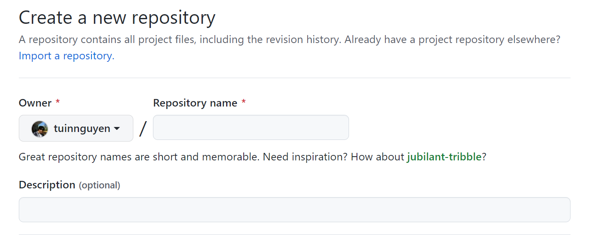
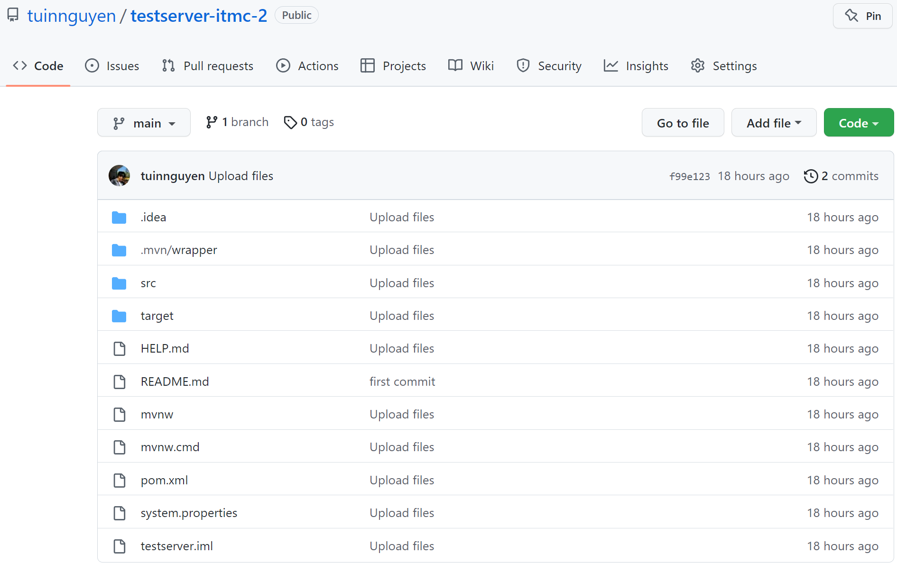
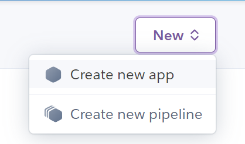
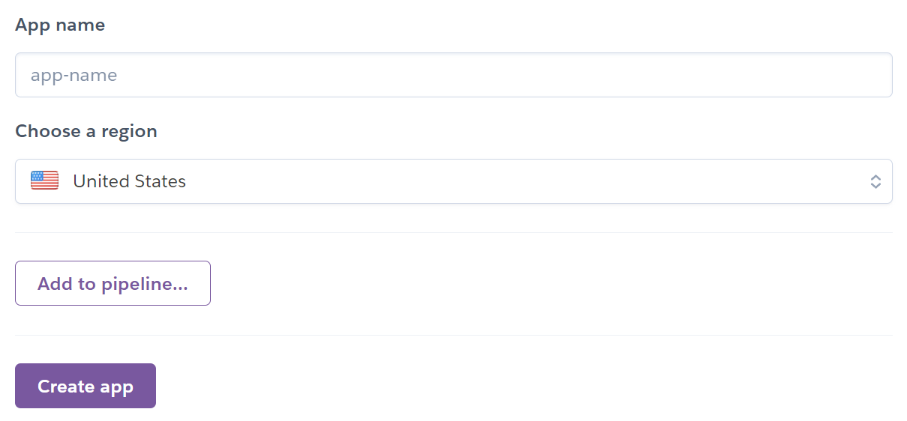
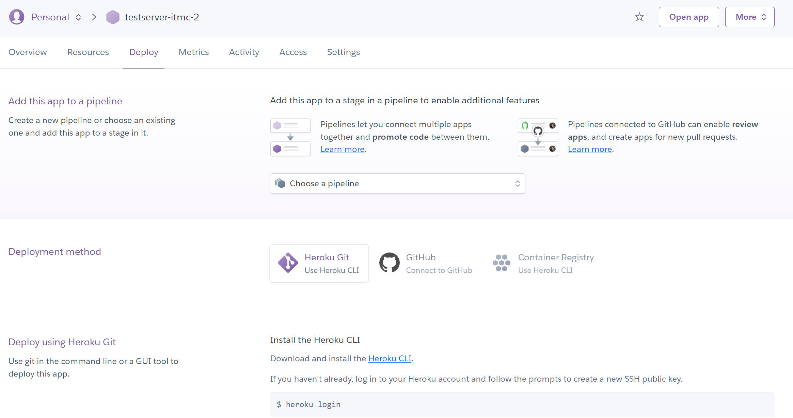
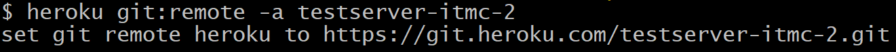
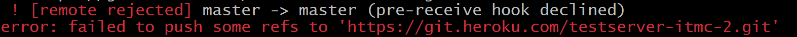

# ITMC's Web Document

## Deploy API to Heroku

### Upload source code to Github

Then you can upload your API's source code into Github.

---

### Create, Build and Deploy app on Heroku

To create a new app on Heroku, first get yourself an account. If you already got one then look up at the top right corner click the **New** button then select **Create new app**

Then you will see something like this.

The only thing you will concern is the "App's name". Pick one and type in the box. Then click **Create app**.

Then you will be directed to a new page should look like this:

This page is the instruction to get your app up and running on Heroku.
I'll assume that you already install the Heroku CLI. If not, you can follow this link: [Heroku CLI](https://devcenter.heroku.com/articles/heroku-cli).
Since, we have created a git repo before. We will add our API this way:
1. Open up your command line.
2. Change directory to the app's git repo.
3. Use the command: `$ heroku git:remote -a testserver-itmc-2`.

After you press **Enter**, the command line will run and you should see something like this:

Then you will deploy the app to Heroku using this command: `$ git push heroku main`.
You will receive a lot of information but you may see something like this:

This error occur since we have not install the correct buildpack for our app.

To fix this problem, you can follow this link to install the proper buildpack for the API: [Java buildpack](https://elements.heroku.com/buildpacks/heroku/heroku-buildpack-java).

***Install Java buildpack:***

- First come back to your command line then change directory to your git repo.

- In this example the Java version is Java $11$. Then I'll type the follow command. You should change the version to fit your Java version.

    - Command: `$ echo "java.runtime.version=11" > system.properties`
- After running the above command, a file should be created in the current directory. Don't freak out!
- You have select the Java version for the buildpack. Then you have to create a new Heroku app that uses your buildpack. Use this command: `$ heroku create --buildpack <your-github-url>
`
- Configure an existing Heroku app to use your buildpack. Use this command: `$ heroku buildpacks:set <your-github-url>`

- Then use the command `$ git push heroku main` to build the app again.

At this momment the app should be built and deploy onto Heroku. You can check the process by open the tab Overview and check the latest activity.

---

## Links

- [Heroku Java Buildpack](https://elements.heroku.com/buildpacks/heroku/heroku-buildpack-java)
- [Heroku API deploy process](https://www.callicoder.com/deploy-host-spring-boot-apps-on-heroku/)